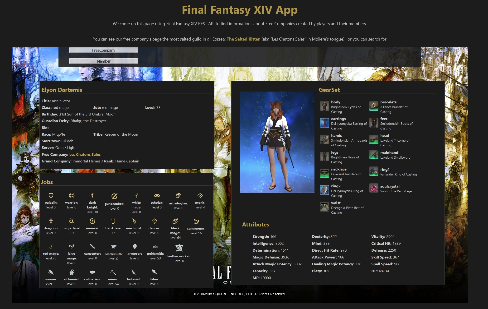

# FINAL FANTASY XIV APP

An app based on the online REST API [xivapi](https://xivapi.com/). 

You can search for Free Companies (guilds created by players) or players avatars from the MMORPG **Final Fantasy XIV**.

You can see a demo on heroku [here](https://final-fantasy-xiv-app.herokuapp.com/).

## Getting Started

Just click on "Free Company" or "Member" to start searching. 

**Free Company Page**

This page shows all essentials informations about a Free Company as its name, server, roles members are looking for, but also its members list.

**Member Page**

This page shows informations about a player's avatar like his appearance, his stuff, his current job and level but also the list of all the classes and jobs of the game with their level if the player has completed them. 

If the player is registered in a Free Company, you can click on its name to go to the Free Company Page.

## Built with

**Front:**
* ReactJS
* Hooks to centralize data about Free Companies and avatars
* Jest for tests (ongoing)
* Dependencies:
  * axios
  * styled-components
  * react-router-dom

**Back:**
* Node
* Jest for tests (ongoing)
* Dependencies:
  * nodemon   
  * axios
  * express
  * dotenv
  
## Author

Hi, I'm Fullstack Js developer since october 2019. I use to work in Communication an PR for five years before starting a professional retraining in web development. 
You can check my [Linkedin profile](https://www.linkedin.com/in/melanie-caro/) or my [website](http://melaniecaro.fr/) (frequently updated)